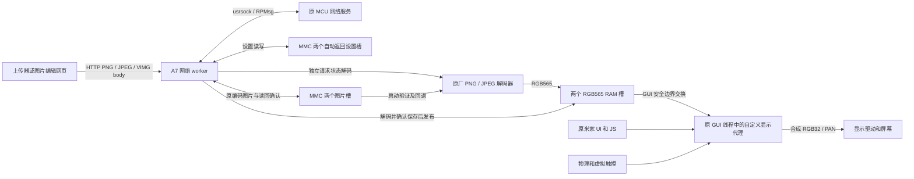

# 86V1 自定义固件架构

本页描述 **86V1 自定义固件**的六页图片持久保存版本
`maintained-persistent-images-six-page-20261008-a`，仅适用于本机精确的 1.50.10 映像。
图片上传、下拉画面和可保存的自动返回设置是当前功能。新增 MMC 图片双槽和第六个
Flash 页，522-input candidate 和 528-input freeze 已完成，566 组实际 ARM、7 项 ABI、
139 项当前候选 writer、12 项 release、299 项 host HTTP 和 30 项网页检查通过。
本轮已安装：五页版自身恢复、六页原始基线检查、六页安装、完整页/native/cache/context、
outer GLOBAL、暖读回及 fresh patched 检查通过。PNG/JPEG 保存后独立 AON GLOBAL 暖复位
自动重载及完整 RGB565 读回通过；完整断电仍按用户要求跳过。旧五页及四页结果单列保留。
源码入口见 [firmware](../firmware/README.md)，精确材料位于 ignored 的 release 快照，
本轮独立证据见 [六页发布结果](../firmware/releases/maintained-persistent-images-20261008-a.json)。
[五页发布结果](../firmware/releases/maintained-images-20261008-a.json)分别记录它的安装、直接 HTTP、
浏览器请求、完整 RGB565 读回及尚未验收的 LCD、用户交互和米家项目。
[历史四页自动返回版结果](../firmware/releases/maintained-idle-return-20261007-a.json)单列离线、硬件及用户观察。
[此前 g 的结果](../firmware/releases/maintained-http-20261007-g.json)、
[此前 d 的结果](../firmware/releases/maintained-http-20261007-d.json)、
[此前 c 的结果](../firmware/releases/maintained-http-20261007.json)及冻结材料独立保留。
旧图片实验版（`native-image-drawer`）的三页 TCP 原型另有 [manifest](../analysis/persistence/native-image-drawer-patch-inputs-1.50.10.json)
和 [硬件结果](../analysis/persistence/native-image-drawer-hardware-result.json)。

## 程序与原系统的关系

补丁包装原 `vapp` 的启动入口，分配自己的画布和上下文，安装 GUI callback 代理，
再进入原应用一次。原 NuttX、板级初始化、显示/触摸驱动、App/JS 线程与 MCU 服务继续
运行；隐藏原界面不退出或重新初始化原 Framework。它是持久化设备端程序，尚不是
独立构建的完整固件，也没有找到通用的官方 UI 插件 API。

bootstrap pthread 使原 GUI 所属 timer 完成代理安装，等待 ready 后继续运行网络 server。
本轮创建线程时显式传递 16B 默认调度属性和 16384B 栈，容纳原生解码调用；
模型中的栈观测及边界守护不等于实机调度或所有输入的栈上界证明。
稳态触摸、手势和绘图在原 GUI 线程执行；这个独立网络 worker 不在 GUI callback
内等 socket。早期纯界面实验的 bootstrap 安装后退出属于历史版本，不能套用于当前程序。
系统 `panel_apps` 仍负责背光和息屏。自定义固件观察系统状态来准备自定义 owner，
没有新建锁屏 App 或重初始化原系统的 GUI/字体服务。

## 当前交互与所有权

开机先展开默认地址画面；worker 在 GUI ready 后读取图片槽，成功解码后通过既有
pending 交接展示保存的图片。没有可恢复图片时保持默认画面。上传后展示图片；连续两次
短按可切换最新图片和 IP:18086，切换不丢弃图片。地址页接收新上传时仍保留地址页。上滑收起，原界面顶边起手
下拉展开，短拉后松手回弹。双击只接受物理短按的完整接触序列，拖动、动画中接触、
虚拟输入和唤醒接触不参与计数；一次双击消费一对轻触。

自定义固件取消了自己的第三键三击检测，原 MCU 按键动作继续由原系统处理。历史第三键
P3_1、bit25、低电平采样及三击版本完整保留，不能因当前版本移除入口而改写旧实验。

原界面在后台继续绘图，自定义 owner 时阻止其 PAN 和 UPDATEAREA 提交。两路原输入
继续消费样本，但隐藏原界面得到 release；顶边手势从第一 DOWN 开始截取整个接触，
动画中新接触一直消费到松手。已经按下的虚拟输入阻止新的顶边截取。

owner 交接由 GUI callback 内的事务完成：释放输入、等待旧显示队列排空、锁两个
touch publisher、核对 ring 和真实释放状态、提交新源，最后更新 owner。原界面恢复
使用持久 mmap `0x50000000`，自定义使用 owned RGB32。画布在回调/帧队列存续期间
保持有效，不通过重复启动原应用切换。

动画继承 smooth 版本：从有效的已提交位置启动，先提交起点并取得新 CLOCK，随后
限制每次逻辑推进，避免调度延迟直接吃掉全部剩余动画。PAN 接受与 LCD 扫描完成
仍是不同事件，真实原生调用耗时没有严格上界。

## 息屏与唤醒

原 `panel_apps` 在关闭背光后把 `0x384ea638` 写为 0，在恢复亮度后写为 1。
代理 timer 先执行原 TIMER，再观察该状态；观察到 off 时要求 custom owner，通过
同一安全交接完成切换，不调用背光接口。恢复 on 后，第一个物理接触一直到 UP 都
不参与双击识别，但仍允许抽屉手势。

这是对可观察状态的处理：完整 off/on 若发生在两次 timer 采样之间就无法识别，
用户于 2026-10-07 确认 c 的息屏唤醒测试正常，后续版本未借用这个用户验收。
没有找到通用的锁屏插件生命周期入口。

## 自动返回与设置

原界面连续未触摸达到等待时间后，通过已有安全 handoff 返回图片，没有动画。
默认 60 秒，网页设置 0–3600 整数秒，0 关闭定时返回。只有触摸屏接触影响计时，
物理键不重置；持续接触、待处理触摸、手势或显示交接未闭合时不执行到期 PAN。
修改设置重新开始完整间隔。定时返回不控制背光，也不影响上面的息屏返回规则。
运行计时使用 224B context 的新尾字段。

GET/POST `/api/settings` 与图片共享网络 worker，设置值通过 broker mutex 发布。
持久化使用 `/data/86v1-return.0` 和 `.1` 两个 16B `VRT1`/sequence/seconds/XOR 槽，
启动取有效新序列或默认值。保存检查两槽文件归属与 FAT 对象，完整写入、fsync、close、
读回验证后才更新运行值并返回 HTTP 200。文件与原厂身份分离，NOR 安装/恢复不修改它们。
失败不承诺旧持久值原样保留。接口、用户操作和实机验收边界见 [自动返回说明](auto-return.md)。

## 网络、图片与持久保存

端口 **HTTP 18086** 采用 [HTTP 图片 API](http-image-api.md)，不提供旧 raw TCP/VACK
兼容入口。本轮 `POST /api/image` 按内容签名识别完整 PNG、JPEG 或 VIMG，
Content-Length 为 1..1048576B。PNG/JPEG 要求 480×320，受支持范围见
[HTTP 图片 API](http-image-api.md)；设备不自动裁切缩放。旧 VIMG 仍是固定 307216B
header/body 和 FNV 校验。完整接收、解码、校验、MMC 同步及独立读回，再发布到 GUI
待消费槽后返回 202。它确认保存及排队，不确认 LCD 扫描；图片文件保存在 MMC，不写 NOR。
当前版本的 `GET /` 沿用正式网页 `https://wan.sh/xiaomi-86v1/` 的 303 配置，把设备
endpoint 放在普通 `device` query 参数中，不依赖电脑开发服务器。更换目标 URL 要创建、
冻结并安装新 release。显式配置空 URL 的构建仍提供 200 说明页，但它不是本轮发布的配置。

接收端不要求 Content-Type；非 identity Content-Encoding 返回 415。PNG 使用完整 chunk、
CRC、IEND 与压缩流收尾检查，JPEG 要求受限 baseline 单扫描、真实 EOI 和无损坏警告。
仅解码出足够像素不会发布。两个解码器都使用每请求的独立状态及 row 缓冲，不初始化
或复用共享 GUI 图片缓存；JPEG 包装只进入已审查的私有初始化路径，不接管原 GUI 资源。
三个格式都先分配完整 encoded body（最多 1MiB），在 inactive RGB565 槽解码，
确认持久保存并释放临时资源后才标记 pending。失败保留旧 active 图片，网络等待、解码和文件 I/O 不持
GUI/publisher 锁；可用堆及原生 RPC 的真实耗时仍须实机确认。

[图片编辑网页](frontend.md)在浏览器内完成裁切、缩放，生成 PNG 和旧 VIMG，直接调用面板
API；Cloudflare 托管静态文件，不代理图片或访问用户的局域网。设备地址可由
`device` query 或用户手动输入，图片处理与下载不依赖面板连接。只有用户点击发送才
GET `/api/image` 查询能力；六页源码返回 PNG/JPEG/VIMG 和 `persistent: true`，其他设备上的旧维护版明确 404 才选择
VIMG。网络错误、无效能力响应及失败 POST 都不会触发自动换格式重发。

OPTIONS/CORS 已实现，origin 为 `*`，允许 GET、POST 与 Content-Type。历史四页 a 实际 GET
默认 60 秒，POST/GET 0 与 5 一致，3601 返回 422 且仍保留运行值 0；直接 Node 图片
POST 返回 202。这些接口检查不证明浏览器预检或 LCD 扫描。
此前 g 的 Windows Chrome 跟随真实 303 打开正式 HTTPS 页面、填写 endpoint 且无页面错误，
随后出现浏览器本地网络访问授权提示，自动验证没有发送 POST。用户报告该正式页面上传
正常；随后只读状态显示新 generation 已被 GUI 消费。这不是自动采集的 HTTP 状态、
内容读回或 LCD 扫描证据。
这些旧 HTTP 检查不验证本轮持久保存。五页能力 GET200、设置 GET60、直接 Node 的
PNG/JPEG POST202 及完整 RGB565 读回保留在历史表中，不能推定六页已安装或保存后可重启恢复。
没有客户端认证。A7 socket 经 usrsock/RPMsg 使用原 MCU 网络服务。
一次处理一条连接；待发布图片被 GUI 消费前，worker 不继续接受下一次上传。

一次 1843200B owned 分配包含 RGB32 画布 614400B、原画面快照 614400B，以及两个各
307200B 的 RGB565 槽。worker 只写 inactive 槽，接收完整、通过格式校验及持久保存确认后标记 pending。
GUI 在帧队列为空、无活动 gesture/overlay 时短持 broker mutex 交换槽位，再把 RGB565
合成到 RGB32。部分/损坏上传不替换现有图片，网络等待不持 GUI/publisher 锁。

图片的原编码文件保存在 `/data/86v1-image.0` 和 `.1`，显示仍使用两个 RGB565 RAM 槽。
每个文件为 20B little-endian `VPI1` header，加完整 PNG/JPEG/VIMG：magic、sequence、
length、body FNV-1a 和前 16B header 的 FNV-1a 各占 4B；输入限 1..1048576B。
文件序列奇偶与槽号对应，按有符号差值比较相邻序列并处理 u32 回绕。

网络 worker 私有的 16B `panel_image_store` 保存 sequence/length/hash/valid，不扩大
224B broker。启动检查两槽头、完整 body hash 和 EOF，依次尝试新槽及旧槽，只有实际
解码成功才记为已知可恢复记录。新版损坏或不可解码可回退旧图；外来文件、I/O 或 OOM
时仍尝试另一个有效槽。全部失败保持默认图，404 正常缺省，其余状态写入 server_error。

保存先完整预检两槽。已有可恢复记录必须仍匹配已知 sequence/length/hash，才能仅写
另一槽；即使较新文件 hash 正确但不可解码，也保护实际回退的旧图。新序列越过已有记录，
必要时再加一以匹配目标槽奇偶。短读写完整循环，随后 fsync、close，独立重新打开并
逐字节、header、hash 和 EOF 读回确认后才更新 worker 状态。foreign 文件返回 409，
I/O、资源或确认失败返回 503，不自动重试。少于 4B 的现有文件无法证明归属，按 foreign 保护。

保存确认后若发布锁、owner 或网络响应失败，文件可能已经保存，即使客户端未收到 202。
双槽中断模型只证明应用选择与旧槽保护，不证明真实 FAT/MMC 或 RPMsgFS 掉电耐久性。
NOR 备份及安装/恢复不包含、不删除图片和自动返回设置文件；回退到旧固件也不清除它们。
启动分配/worker 创建失败且尚未启动原应用时释放自有资源并回退原入口。原应用返回后
已发布的 allocation 仍保持存活，避免回调或 worker 引用释放内存。

HTTP header 使用另外分配的 2048B 缓冲。应用设置 5 秒无进展、30 秒总请求期限，但
底层 native/RPMsg RPC 本身没有严格时间上界；连接错误也不保证客户端收到完整错误响应。

地址由 `wlan0`、40B `ifreq` 和 `SIOCGIFADDR=0x701` 查询。接口名@0、family@20、
IPv4@24；在 broker mutex 外以约 1 秒间隔查询，仅改变地址时标记重画，查询失败清为 0。
尚无地址时显示 `0.0.0.0:18086`，它不能作为上传目标。实际设备网络地址不提交到 Git。

## 代码、页面与上下文布局

| 项目 | 当前值 |
| --- | --- |
| 主 BIN | 3368B，`0x3804b108..0x3804be30`，容器余 64B |
| 主代码容器 | 3432B，exclusive 末端 `0x3804be70` |
| 辅助 BIN | 396B，`0x3807a764..0x3807a8f0` |
| 辅助容器 | 444B，exclusive 末端 `0x3807a920` |
| Thumb 入口 | `0x3804b2f5` |
| 网络 BIN | 3940B，`0x3804d000..0x3804df64`，容器余 140B |
| 网络代码容器 | 4080B，exclusive 末端 `0x3804dff0` |
| 解码 BIN | 3012B，`0x38047098..0x38047c5c`，容器余 336B |
| 解码代码容器 | 3348B，exclusive 末端 `0x38047dac` |
| 存储 BIN | 1676B，`0x38052000..0x3805268c`，容器余 1380B；含 HTTP header 接收函数 |
| 存储代码容器 | 3056B，exclusive 末端 `0x38052bf0` |
| NOR code/entry/aux/net/codec/store 页 | `0x92b000` / `0xccd000` / `0x95a000` / `0x92d000` / `0x927000` / `0x932000`，各 4096B |
| 安装基线及直接回退目标 | 精确的旧图片实验版三页与原厂网络/解码/存储页 |
| 完整 ELF SHA-256 | `f7e4d2bbeff500ac997e694846523ddc025f94d88d1bccf7306419233ae6fcd3` |
| 522-input candidate SHA-256 | `e061db87d2e4e4aa1e2836a89fa1dd1f47215826914b5b492b59b9bce7388591` |
| 528-input freeze SHA-256 | `9a3f4d7e39a1451d7bef16672415d4183f516234a3741d986d3c721b6d39a801` |

所有范围末端 exclusive。入口页新增禁用 `uorb_unit_test` builtin 的单字修改：page+`0xc3c`
从 `0x3804cf3d` 改为 `0x3804b109`。它不是启动服务；其其他已发现引用属于命令描述/帮助
统计，不会调用函数。网络段位于该独立审查函数内部，保留所在页最前 4B 和最后 12B；
原厂完整网络页 SHA 为 `76a994fbd3892960f43db969b4744fbb726d23feac5c24df86041398ee5d299d`。
解码页借用 `filldisk/fillcpu/fillmem` 诊断群；入口页 `+0xd68/+0xd7c/+0xca0` 的原指针
改为相同禁用 stub。解码页前 156B、后 592B 和实际 BIN 外字节保留，原页 SHA 为
`21c40d397e6ec14f61011544f736962470f623c91ba3bbf7a6d89d120ba23c02`。
存储页只借用可选 `monkey` 触摸压力诊断单函数的尾部，入口页 `+0xe6c` 的指针从
`0x38051fd1` 改为禁用 stub `0x3804b109`。该诊断也可由持久调试开关启动，本版放弃它；
不能重新启用其 builtin。页前 4B、后 1036B 与实际 BIN 外字节保留，原页 SHA 为
`6874cd0d613150d2c71c70bbf5513f83f72214304e2891f092d50e6e87d84c71`。
正常启动和恢复使用的 `mkgpt` 已排除，不能借用。
安装 store→codec→net→aux→code→entry，恢复 entry→code→aux→net→codec→store，始终核对六个完整页面。
共享 helper/be70、背光 callback/a920、JSON helper/ae28 和容器外所有字节保留。
wifi_recorder 诊断 builtin 的禁用 stub 继承此前版本，它不是 Wi-Fi 驱动或启动服务；
原工厂 socket worker 只有受控辅助容器被借用，未启用原工厂 UDP 服务。

这里的“安装基线”指设备 Flash 必须先处于指定的完整字节集合：“三页”是已装旧图片
实验程序的三个 4KiB Flash 区域，网络、解码和存储三个区域仍为原厂字节，六页都要逐字节匹配。
它不是三个屏幕界面页，也不是任意原厂设备都能直接首刷的通用起点。

224B context 的部分布局如下，已有字段的偏移不变，新计时状态追加在尾部。
旧 tap-fast、旧图片实验版及旧维护版 212B 的字段解释不能直接套用新尾字段。

| 字节偏移 | 字段 |
| --- | --- |
| +128 | 自有双击状态（含唤醒接触排除标记） |
| +144 | screen_off：0=awake，1=off observed，2=等待首个唤醒接触松开 |
| +148 | 抽屉手势状态 |
| +164 / +168 / +172 | animation_from / pending / phase |
| +176 / +180 | image / receive 槽指针 |
| +184 | image_pending |
| +188 / +192 | generation / displayed_generation |
| +196 / +200 | server_state / server_error |
| +204 | show_address：图片/地址页选择 |
| +208 | IPv4 四个原始网络序字节 |
| +212 / +216 / +220 | return_after_ms / activity_ms / activity_valid |

## 本轮六页检查点与局限

566 组实际 ARM 检查包含 448 项 codec/VIMG、36 组 UI、42 组 HTTP、17 组设置和
23 组图片存储（264 次实际 ARM 调用）。另有 7 项非零寄存器及错误恢复 ABI、139 项
当前候选六页 writer、12 项 release、299 项 host HTTP 和 30 项网页检查通过。
522-input candidate 与 528-input freeze 已完成；实机结果如下，不借用旧五页证据。

| 证据 | 六页版本结果 |
| --- | --- |
| 迁移与安装 | 五页版自身恢复通过完整五页/native/cache/context、outer GLOBAL 和暖读回；六页 original 检查后安装，完整六页及暖读回闭合，fresh check 为 patched=true |
| 能力与设置只读 | GET `/api/image` 为200，三格式与 persistent:true；GET `/api/settings` 为60，不继承旧版设置 POST 验收 |
| 真实保存及像素 | 307216B VIMG、2204B PNG、55134B JPEG依次POST202，完整307200B RGB565匹配参考，generation/displayed_generation依次1/2/3 |
| 错误图保护 | 坏PNG返回422，保留JPEG与计数3，未替换active画面 |
| JPEG暖重载 | 独立AON GLOBAL暖复位，不执行OS shutdown hooks；自动加载已保存JPEG，计数重新为1，pending0/server1/error0，完整RGB565匹配 |
| 正式网页 | 版本6d2572cb-61e0-40b1-b28f-837e32d53157，HTML/favicon/JS/CSS四项字节一致且200，Chrome零错误、初始零自动LAN请求 |
| 浏览器保存 | agent Chrome显式Send完成GET200、单次6050B PNG POST202，无Content-Type，按钮“画面已保存”；完整RGB565匹配，计数3。仅临时origin-scoped CDP本地网络许可，结束后恢复prompt，非用户点击许可 |
| PNG暖重载 | 浏览器保存后第二次独立AON GLOBAL暖复位，自动加载默认PNG；计数重新为1，pending0/server1/error0，完整RGB565匹配 |
| 用户报告 | 对默认GitHub图片、上下滑、双击与米家状态的合并问题回复“确认正常”；记录为合并观察，没有分别测量这些项目 |
| 未验证范围 | 六页自身硬件restore未测试；完整断电按用户要求跳过，没有真实FAT/MMC掉电耐久性或LCD扫描测量 |

离线模型不证明真实文件系统掉电恢复、LCD 扫描、RPC 时序或所有输入的栈上界。
MEM-AP 像素读回与 GUI 消费也不测量 LCD 扫描；两次暖复位不等于断电恢复。

## 历史五页图片版检查点

五页版 `maintained-images-five-page-20261008-a` 为 main/aux/net/codec 3368/396/4012/2916B，
ELF SHA `3f67d12758931a05fc22e20ddd89c51688ea9ec12de185ededce821b0ead79d3`，
471-input candidate SHA `992b58c7aa72a162aca23756088ce8951467fa1d624ba8c7889a155ab430021b`，
477-input freeze SHA `627a224c619b59a6813b47685e272cd19a4f8b25bb04af1bdbf690b31cf2a330`。
该版图片只在 RAM；下表只记录它的历史结果，不验证六页持久保存。

| 证据 | 五页历史版本结果 |
| --- | --- |
| 离线模型 | 420 项解码器实际 ARM 检查、36 组 UI、34 组 HTTP、17 组设置；299 项 host HTTP 检查 |
| 客户端 | 29 项网页测试；Chrome154 真实 Canvas 多 IDAT PNG 在离线 HTTP/native/GUI 路径完整像素比对通过 |
| 发布及写入流程 | 12 项 release、116 项 writer mock 及 477-input freeze 已完成 |
| 执行路径 | `C:\p86-img-a` 完整 bundle 全部 hash 核对、116 项 mock 与冻结 CLI verify 通过；旧 `C:\p86-idle-a` 只用于其自身四页 release |
| 安装及暖启动 | 五页安装、完整页/native/cache/context、outer GLOBAL 和五页暖读回通过；fresh check 为 patched=true |
| 硬件能力与设置 GET | 能力 GET200 返回 png/jpeg/vimg；设置 GET60。没有继承旧版设置 POST 验收 |
| 直接图片 HTTP 与读回 | Node上传2204B PNG为202/计数1、55134B JPEG为202/计数2；两张完整RGB565匹配独立参考 |
| 错误图保护与最终状态 | 坏PNG CRC为422且保留JPEG及计数2；恢复默认PNG为202/计数3且完整像素匹配；alive/ready1、pending0、server1/error0，GUI cycles推进 |
| 正式网页 | 版本2ee45a5f-6b04-42ce-80bb-2e92e4dc4cc5，五项资源一致、零浏览器错误、初始零自动LAN请求 |
| 实际 HTTPS 浏览器上传 | agent Chrome 点击 Send：GET 能力200、单次6050B PNG POST202，未添加 Content-Type；origin-scoped CDP 临时授予本地网络权限，非用户点击许可，结束后恢复 prompt |
| 浏览器上传后只读核验 | 完整307200B RGB565 匹配默认图参考，槽位和计数稳定；generation/displayed_generation=4、pending0、alive/ready1、server1/error0，GUI cycles 推进；不测量 LCD 扫描 |
| 用户验收 | 用户浏览器权限/上传、LCD、原界面交互、自动返回、息屏与米家待分别确认；Node请求耗时不作为性能基准 |
| 迁移前后检查 | 旧四页版 patched→自身 restore→新五页 original→五页 install→fresh patched，各自完整集合单列验证 |
| 原发布恢复检查点 | 当时旧四页版自身 restore 已通过；五页版自身硬件 restore 尚未测试 |
| 完整断电 | **按用户明确要求跳过**，没有借用旧版冷启动结论 |

五页版自身恢复后来在本轮六页迁移中通过完整五页/native/cache/context、outer GLOBAL
和暖读回，记录在新六页结果中。上表保留五页原始发布检查点，不改写其旧 result。

模型执行真实 ELF 和已核对 SHA 的原厂解码指令，OS、分配器、部分 libc、锁和 GUI 驱动边界
仍由 mock 提供；不证明可用堆、真实 RPC/调度、LCD 或全输入的栈上界。HTTP ELF 仅加载
allocated PROGBITS sections，保留原厂代码在 ELF 地址空洞中的字节，不能用 PT_LOAD
的空洞零填充代替。上述 Canvas 检查也不是浏览器实际网络 POST 或实机显示证据。
正式页面的独立实机浏览器请求已在上表记录，不能与离线Canvas证据混为一项。
最初浏览器本地网络 prompt 阶段 GET 等待，没有 POST；agent 仅对测试 Chrome 的正式网页
origin 临时授予 CDP 权限后才完成一次发送，测试结束后权限已恢复为 prompt，
没有把它记录为用户授予权限。完整 RGB565 与计数通过另一次只读 MEM-AP 核验，
浏览器请求和像素读回都不证明 LCD 扫描或用户交互验收。

## 历史四页自动返回版检查点

历史四页自动返回版为 `maintained-idle-return-four-page-20261007-a`：main/aux/net
3344/396/4072B，382-input freeze，候选 SHA
`6022cbd3e41cfc913a260ff17855582c47656318227dfb6defc55230be503f55`，冻结表 SHA
`660534d525762b83b8029b3adebd82a20d84723d5706e53afc6f6790a5c64cb4`。
当时 76 组实际 ARM、290 项 host、93 项短根 writer mock、12 项 release 和 19 项网页测试
通过。g 自身恢复后四页 a 安装、完整页和暖读回通过；原始结果中 a 自身恢复未测试。
其自身恢复现已在本轮五页迁移中通过，记录在新迁移证据，不改写旧发布结果。
真实默认 GET60、POST/GET0 和 5、3601 返回422且保留运行值通过；保存5后一次独立
AON GLOBAL 暖复位加载5，随后保存回60。直接 Node VIMG POST202，GUI消费后
generation/displayed_generation=1、pending0/server1/error0/return_after_ms60000。
它不证明 LCD、浏览器上传或用户交互/米家验收。正式网页部署为
`ecf90b3d-d93f-4a09-aab7-7d5b513a9d49`，精确资源和初始零LAN请求/无页面错误通过。
这类历史 result 保持原样；后续恢复结果将在新迁移记录中补充，不改写旧结果。

这些是保存的检查点，不表示实时运行监控。MEM-AP 样本非原子，HTTP 202 不测量扫描时刻。
此前 g 的 GET 与浏览器自动填地址有独立实测；HTTPS 网页上传由用户报告正常，随后只读
状态显示 generation/displayed_generation=1。本轮没有自动采集其 POST 状态或上传后
像素。用户同时收到米家、默认图等合并问题，但简短回复未
分别确认这些项目，因此保留当时未验收范围。g 自身 restore 在迁移至四页自动返回版时另行记录，
不改写旧 g 的原结果。

此前 d 的错误 FNV/magic 请求没有增加 generation；两次完整上传后 generation 和
displayed_generation 均为 2，用户确认默认卡片显示及手机 LAN 跳转。这些历史检查点
保留在 d 结果中；d 的硬件 restore 后来在 d→g 迁移中通过，不覆盖 d 原 result。
`server_error` 记录最近请求错误，不能单独当作 worker 故障。

旧图片实验版的 33 组 ARM、12 组独立检查、70 项 writer mock，以及用户确认的两图、
上下滑、key3 往返和米家控制仅属于旧三页 TCP 版本。其无效 header、half-close 和
10.038 秒 idle 观察保留在 [历史协议](image-upload-protocol.md)，不作为当前 HTTP 验收。

原字体只完成静态可行性分析，未调用实机字体文件或 glyph API。当前采用私有数字字形
显示地址，来图已经光栅化；不能宣称已复用系统字库。
