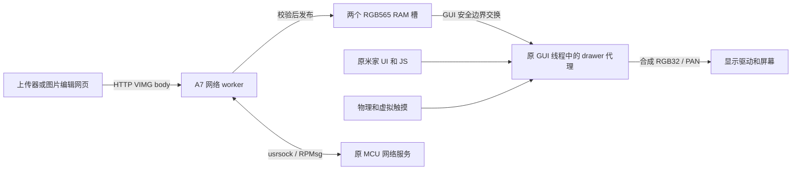

# 当前图片下拉屏幕架构

本页描述本机精确 1.50.10 映像上的维护版 **maintained-http-four-page-20261007-d**。
源码、四页布局与离线审查已冻结，四页读回、状态闭包、暖启动、真实 303 跳转和 HTTP 上传通过；
用户已确认 d 的默认 GitHub 图片正常显示及手机 LAN 跳转打开网页；双击、上下滑、
三击取消、息屏唤醒及米家验收仍待记录，不能继承旧版验收。
源码入口见 [firmware](../firmware/README.md)，精确材料位于 ignored 的 release 快照。
[当前发布结果](../firmware/releases/maintained-http-20261007-d.json)单列离线、硬件及用户观察。
[此前 c 的结果](../firmware/releases/maintained-http-20261007.json)及冻结材料独立保留。
最后确认的旧三页 TCP 原型另有 [manifest](../analysis/persistence/native-image-drawer-patch-inputs-1.50.10.json)
和 [硬件结果](../analysis/persistence/native-image-drawer-hardware-result.json)。

## 程序与原系统的关系

补丁包装原 `vapp` 的启动入口，分配自己的画布和上下文，安装 GUI callback 代理，
再进入原应用一次。原 NuttX、板级初始化、显示/触摸驱动、App/JS 线程与 MCU 服务继续
运行；隐藏原界面不退出或重新初始化原 Framework。它是持久化设备端程序，尚不是
独立构建的完整固件，也没有找到通用的官方 UI 插件 API。

bootstrap pthread 使原 GUI 所属 timer 完成代理安装，等待 ready 后继续运行网络 server。
稳态触摸、手势和绘图在原 GUI 线程执行；这个独立网络 worker 不在 GUI callback
内等 socket。旧 drawer 的 bootstrap 安装后退出属于历史版本，不能套用于当前程序。
系统 `panel_apps` 仍负责背光和息屏。维护版观察系统状态来准备自定义 owner，
没有新建锁屏 App 或重初始化原系统的 GUI/字体服务。

## 当前交互与所有权

开机默认展开地址画面。上传后展示图片；连续两次短按可切换最新图片和 IP:18086，
切换不丢弃 RAM 图片。地址页接收新上传时仍保留地址页。上滑收起，原界面顶边起手
下拉展开，短拉后松手回弹。双击只接受物理短按的完整接触序列，拖动、动画中接触、
虚拟输入和唤醒接触不参与计数；一次双击消费一对轻触。

维护版取消了自己的第三键三击检测，原 MCU 按键动作继续由原系统处理。历史第三键
P3_1、bit25、低电平采样及三击版本完整保留，不能因维护版移除入口而改写旧实验。

原界面在后台继续绘图，自定义 owner 时阻止其 PAN 和 UPDATEAREA 提交。两路原输入
继续消费样本，但隐藏原界面得到 release；顶边手势从第一 DOWN 开始截取整个接触，
动画中新接触一直消费到松手。已经按下的虚拟输入阻止新的顶边截取。

owner 交接由 GUI callback 内的事务完成：释放输入、等待旧显示队列排空、锁两个
touch publisher、核对 ring 和真实释放状态、提交新源，最后更新 owner。原界面恢复
使用持久 mmap `0x50000000`，自定义使用 owned RGB32。画布在回调/帧队列存续期间
保持有效，不通过重复启动原应用切换。

动画继承 smooth 版本：从有效的已提交位置启动，先提交起点并取得新 CLOCK，随后
限制每次逻辑推进，避免调度延迟直接吃掉全部剩余动画。PAN 接受与 LCD 扫描完成
仍是不同事件，真实原生调用耗时没有严格上界。

## 息屏与唤醒

原 `panel_apps` 在关闭背光后把 `0x384ea638` 写为 0，在恢复亮度后写为 1。
代理 timer 先执行原 TIMER，再观察该状态；观察到 off 时要求 custom owner，通过
同一安全交接完成切换，不调用背光接口。恢复 on 后，第一个物理接触一直到 UP 都
不参与双击识别，但仍允许抽屉手势。

这是对可观察状态的处理：完整 off/on 若发生在两次 timer 采样之间就无法识别，
用户于 2026-10-07 确认 c 的息屏唤醒测试正常；d 的 UI BIN 虽相同，仍未借用这个用户验收。
没有找到通用的锁屏插件生命周期入口。

## 网络与图片 RAM

端口 **HTTP 18086** 采用 [HTTP 图片 API](http-image-api.md)，不提供旧 raw TCP/VACK
兼容入口。`POST /api/image` 接收固定 307216B 的 VIMG header 与 480×320 RGB565 body。
完整校验并发布到 GUI 待消费槽后返回 202；它不是 LCD 扫描或 Flash 保存完成确认。
当前 d 的 `GET /` 返回 303，指向临时电脑开发页 `http://PC_LAN_IPV4:5173/`，把设备
endpoint 放在 fragment。真实 Location 已与构建配置核对，Chrome 跟随后自动填写地址。
电脑及开发服务器须保持运行；未来更换目标 hostname 要创建、冻结并安装新 release。
未配置 URL 的构建仍提供 200 说明页，但它不是当前 d 的配置。

接收端不要求或检查 Content-Type，直接验证 Content-Length、VIMG、尺寸及 FNV；
网页不添加该 header，cURL 示例也不指定 `-H`。真实网页和 cURL 完整图片上传均返回 202。

[图片编辑网页](frontend.md)在浏览器内完成裁切、缩放和 RGB565 转换，直接调用面板
API；Cloudflare 后续只托管静态文件，不代理图片或访问用户的局域网。设备地址可由
fragment 或用户手动输入，图片处理与下载不依赖面板连接。

OPTIONS/CORS 已实现，当前 origin 为 `*`，支持本机与 LAN 前端；本轮没有单独重做
OPTIONS 请求。用户已确认手机 LAN 跳转打开开发页；手机上传及 HTTPS 云网页到局域网
尚未端到端验证。
没有客户端认证或设备端 PNG/JPEG 解码。A7 socket 经 usrsock/RPMsg 使用原 MCU 网络服务。
一次处理一条连接；待发布图片被 GUI 消费前，worker 不继续接受下一次上传。

一次 1843200B owned 分配包含 RGB32 画布 614400B、原画面快照 614400B，以及两个各
307200B 的 RGB565 槽。worker 只写 inactive 槽，接收完整并通过 FNV 后标记 pending。
GUI 在帧队列为空、无活动 gesture/overlay 时短持 broker mutex 交换槽位，再把 RGB565
合成到 RGB32。部分/损坏上传不替换现有图片，网络等待不持 GUI/publisher 锁。

图片只在 RAM 中，重启丢弃；Flash 保存的是程序。没有实现 `/data` 写入或图片恢复。
启动分配/worker 创建失败且尚未启动原应用时释放自有资源并回退原入口。原应用返回后
已发布的 allocation 仍保持存活，避免回调或 worker 引用释放内存。

HTTP header 使用另外分配的 2048B 缓冲。应用设置 5 秒无进展、30 秒总请求期限，但
底层 native/RPMsg RPC 本身没有严格时间上界；连接错误也不保证客户端收到完整错误响应。

地址由 `wlan0`、40B `ifreq` 和 `SIOCGIFADDR=0x701` 查询。接口名@0、family@20、
IPv4@24；在 broker mutex 外以约 1 秒间隔查询，仅改变地址时标记重画，查询失败清为 0。
尚无地址时显示 `0.0.0.0:18086`，它不能作为上传目标。实际设备网络地址不提交到 Git。

## 代码、页面与上下文布局

| 项目 | 当前值 |
| --- | --- |
| 主 BIN | 2946B，`0x3804b108..0x3804bc8a` |
| 主代码容器 | 3432B，exclusive 末端 `0x3804be70` |
| 辅助 BIN | 236B，`0x3807a764..0x3807a850` |
| 辅助容器 | 444B，exclusive 末端 `0x3807a920` |
| Thumb 入口 | `0x3804b2f5` |
| 网络 BIN | 2948B，`0x3804d000..0x3804db84` |
| 网络代码容器 | 4080B，exclusive 末端 `0x3804dff0` |
| NOR code/entry/aux/net 页 | `0x92b000` / `0xccd000` / `0x95a000` / `0x92d000`，各 4096B |
| 安装基线及直接回退目标 | exact image drawer 三页与 stock 网络页 |
| 当前冻结输入数 | 380；其中候选输入 374，另加候选 manifest 与五份证据 |
| 候选 manifest SHA-256 | `aba4a3e5021af175a3d6cd9dc90eac4559154d34711b647bbc8a48043ce5d9fe` |
| 冻结表 SHA-256 | `3af60edcb71636fbe227237f7c7f8b23d4135571b2e45651583665d4466a2632` |

所有范围末端 exclusive。入口页新增禁用 `uorb_unit_test` builtin 的单字修改：page+`0xc3c`
从 `0x3804cf3d` 改为 `0x3804b109`。它不是启动服务；其其他已发现引用属于命令描述/帮助
统计，不会调用函数。网络段位于该独立审查函数内部，保留所在页最前 4B 和最后 12B；
原厂完整网络页 SHA 为 `76a994fbd3892960f43db969b4744fbb726d23feac5c24df86041398ee5d299d`。
安装 net→aux→code→entry，恢复 entry→code→aux→net，始终核对四个完整页面。
共享 helper/be70、背光 callback/a920、JSON helper/ae28 和容器外所有字节保留。
wifi_recorder 诊断 builtin 的禁用 stub 继承此前版本，它不是 Wi-Fi 驱动或启动服务；
原工厂 socket worker 只有受控辅助容器被借用，未启用原工厂 UDP 服务。

212B context 的部分布局如下。大小保留，但维护版复用旧按键状态区为轻触/息屏状态，
并把旧 reserved 改为地址页标记。旧 tap-fast 和旧 image drawer 的字段解释不可直接复用。

| 字节偏移 | 字段 |
| --- | --- |
| +128 | 自有双击状态（含唤醒接触排除标记） |
| +144 | screen_off：0=awake，1=off observed，2=等待首个唤醒接触松开 |
| +148 | 抽屉手势状态 |
| +164 / +168 / +172 | animation_from / pending / phase |
| +176 / +180 | image / receive 槽指针 |
| +184 | image_pending |
| +188 / +192 | generation / displayed_generation |
| +196 / +200 | server_state / server_error |
| +204 | show_address：图片/地址页选择 |
| +208 | IPv4 四个原始网络序字节 |

## 验证检查点与局限

| 证据 | 当前版本结果 |
| --- | --- |
| 离线模型 | 24 组实际 ARM UI 与 23 组已配置前端的实际 ARM HTTP，共 47 组；261 项 host HTTP parser 检查 |
| 发布及写入流程 | 12 项 release 工具测试、93 项当前 Jim writer mock；独立 ownership、程序及 writer 审查 |
| 安装及暖启动 | 四页完整 SHA 读回、native/cache/context 闭包与 GLOBAL 清理通过，暖启动正常 |
| HTTP | GET/303 Location、网页无 Content-Type 完整 POST/202、cURL 无 `-H` POST/202、无 type 错误 FNV/422、任意 type 错误 VIMG/400、拒绝后 GET/303 通过 |
| 图片编辑前端 | Windows Chrome 跟随真实跳转自动填写地址、完整 VIMG/FNV 网页上传与成功按钮通过，无页面错误；此前编辑/导出检查独立保留 |
| 用户实屏及交互 | d 的默认 GitHub 图与手机 LAN 跳转用户确认通过；双击、手势、三击取消和息屏唤醒仍待验收 |
| 米家 | 当前维护版在线/控制待用户验收 |
| 新启动只读状态 | alive=1、ready=1、mode=1、server=1；上传前 generation/displayed_generation=0，两次完整上传后均为 2、pending=0、server_error=0，GUI cycles 增长 |
| 当前恢复路线 | 先用 c 冻结执行器恢复精确基线，再安装 d；c restore 通过，d restore 尚未执行 |
| 完整断电 | **按用户明确要求跳过**，没有借用旧版冷启动结论 |

这些是保存的检查点，不表示实时运行监控。MEM-AP 样本非原子，HTTP 202 不测量扫描时刻。
d 的错误 FNV/magic 请求未增加 generation；最终两次完整上传后 generation 和
displayed_generation 均为 2。`server_error` 记录最近请求错误，不能单独当作 worker 故障。
两次上传的是默认 GitHub 图，GUI 消费本身不证明 LCD 可见；用户随后独立确认默认
卡片显示正常及手机访问面板地址能打开网页，这个观察不涵盖手机上传或其他交互。
303 和浏览器链路只验证了临时 LAN HTTP 页面，不能写成已部署 Cloudflare 或通过云 HTTPS。

历史 image drawer 的 33 组 ARM、12 组独立检查、70 项 writer mock，以及用户确认的两图、
上下滑、key3 往返和米家控制仅属于旧三页 TCP 版本。其无效 header、half-close 和
10.038 秒 idle 观察保留在 [历史协议](image-upload-protocol.md)，不作为当前 HTTP 验收。

原字体只完成静态可行性分析，未调用实机字体文件或 glyph API。当前采用私有数字字形
显示地址，来图已经光栅化；不能宣称已复用系统字库。
