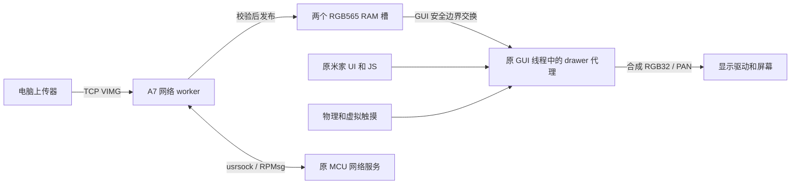

# 当前图片下拉屏幕架构

基线：本机官方 1.50.10 映像上的 **native-image-drawer**，研究整理检查点 2026-10-07。
本页描述已安装原型；下一阶段需求另见 [维护计划](maintenance-plan.md)，不混入当前行为。
权威布局来自 [patch manifest](../analysis/persistence/native-image-drawer-patch-inputs-1.50.10.json)，
实际结果来自 [硬件记录](../analysis/persistence/native-image-drawer-hardware-result.json)。

## 程序与原系统的关系

补丁包装原 `vapp` 的启动入口，分配自己的画布和上下文，安装 GUI callback 代理，
再进入原应用一次。原 NuttX、板级初始化、显示/触摸驱动、App/JS 线程与 MCU 服务继续
运行；隐藏原界面不退出或重新初始化原 Framework。它是持久化设备端程序，尚不是
独立构建的完整固件，也没有找到通用的官方 UI 插件 API。

bootstrap pthread 使原 GUI 所属 timer 完成代理安装，等待 ready 后继续运行网络 server。
稳态触摸、手势、按键和绘图在原 GUI 线程执行；这个独立网络 worker 不在 GUI callback
内等 socket。旧 drawer 的 bootstrap 安装后退出属于历史版本，不能套用于当前程序。
系统 `panel_apps` 仍负责背光和息屏；当前补丁没有新增锁屏生命周期入口。

## 当前交互与所有权

开机默认展开地址画面。上传后自定义内容变为整幅图片，地址不叠到图片上；现安装版
没有双击地址页。上滑收起，原界面顶边起手下拉展开，短拉后松手回弹；第三物理键
三击也可往返。第三键确认是 P3_1、bit25、低电平按下，采样时未绑定米家动作。
补丁不拦截原 MCU 按键通知，后续移除三击只需处理自有切换入口。

原界面在后台继续绘图，自定义 owner 时阻止其 PAN 和 UPDATEAREA 提交。两路原输入
继续消费样本，但隐藏原界面得到 release；顶边手势从第一 DOWN 开始截取整个接触，
动画中新接触一直消费到松手。已经按下的虚拟输入阻止新的顶边截取。

owner 交接由 GUI callback 内的事务完成：释放输入、等待旧显示队列排空、锁两个
touch publisher、核对 ring 和真实释放状态、提交新源，最后更新 owner。原界面恢复
使用持久 mmap `0x50000000`，自定义使用 owned RGB32。画布在回调/帧队列存续期间
保持有效，不通过重复启动原应用切换。

动画继承 smooth 版本：从有效的已提交位置启动，先提交起点并取得新 CLOCK，随后
限制每次逻辑推进，避免调度延迟直接吃掉全部剩余动画。PAN 接受与 LCD 扫描完成
仍是不同事件，真实原生调用耗时没有严格上界。

## 网络与图片 RAM

端口 **TCP 18086** 采用 [VIMG/VACK](image-upload-protocol.md)，当前没有 HTTP、浏览器
重定向、认证或设备端 PNG/JPEG 解码。A7 socket 经 usrsock/RPMsg 使用原 MCU 网络服务。
一次处理一条连接；待发布图片被 GUI 消费前，worker 不继续接受下一次上传。

一次 1843200B owned 分配包含 RGB32 画布 614400B、原画面快照 614400B，以及两个各
307200B 的 RGB565 槽。worker 只写 inactive 槽，接收完整并通过 FNV 后标记 pending。
GUI 在帧队列为空、无活动 gesture/overlay 时短持 broker mutex 交换槽位，再把 RGB565
合成到 RGB32。部分/损坏上传不替换现有图片，网络等待不持 GUI/publisher 锁。

图片只在 RAM 中，重启丢弃；Flash 保存的是程序。没有实现 `/data` 写入或图片恢复。
启动分配/worker 创建失败且尚未启动原应用时释放自有资源并回退原入口。原应用返回后
已发布的 allocation 仍保持存活，避免回调或 worker 引用释放内存。

地址由 `wlan0`、40B `ifreq` 和 `SIOCGIFADDR=0x701` 查询。接口名@0、family@20、
IPv4@24；首次非零地址缓存到本轮运行结束，后续 DHCP 变化不刷新。尚无地址时显示
`0.0.0.0:18086`，它不能作为上传目标。实际设备网络地址不提交到 Git。

## 代码、页面与上下文布局

| 项目 | 当前值 |
| --- | --- |
| 主 BIN | 3416B，`0x3804b108..0x3804be60` |
| 主代码容器 | 3432B，exclusive 末端 `0x3804be70` |
| 辅助 BIN | 424B，`0x3807a764..0x3807a90c` |
| 辅助容器 | 444B，exclusive 末端 `0x3807a920` |
| Thumb 入口 | `0x3804b2f5` |
| NOR code/entry/aux 页 | `0x92b000` / `0xccd000` / `0x95a000`，各 4096B |
| 安装基线及直接回退目标 | 精确冻结的 GitHub tap-fast 三页 |
| 当前冻结输入数 | 93 |
| 冻结表 SHA-256 | `fa99d95a98b3abd4f3e76ce304a4d6a12623f50338d0240a6aba4b91f0a0cf61` |

所有范围末端 exclusive。当前入口页沿用已有字节，但仍按三页集合完整校验。
共享 helper/be70、背光 callback/a920、JSON helper/ae28 和容器外所有字节保留。
wifi_recorder 诊断 builtin 的禁用 stub 继承此前版本，它不是 Wi-Fi 驱动或启动服务；
原工厂 socket worker 只有受控辅助容器被借用，未启用原工厂 UDP 服务。

212B context 前 176B 延续 drawer，新增字段如下。旧 tap-fast 的反馈字段解释不可复用。

| 字节偏移 | 字段 |
| --- | --- |
| +164 / +168 / +172 | animation_from / pending / phase |
| +176 / +180 | image / receive 槽指针 |
| +184 | image_pending |
| +188 / +192 | generation / displayed_generation |
| +196 / +200 | server_state / server_error |
| +204 | 未使用 reserved，保持 0 |
| +208 | IPv4 四个原始网络序字节 |

## 验证检查点与局限

| 证据 | 当前版本结果 |
| --- | --- |
| 离线模型 | 33 组当前 ELF 实际 ARM 模型，12 组独立重点检查 |
| 写入流程 | 70 项 Jim writer mock；独立程序及 writer 审查 |
| 安装及暖启动 | 三页完整 SHA 读回、MCU 运行、临时断点和 reset catch 清理通过 |
| 上传及实屏 | 两次各 307200B，VACK0；用户确认地址和两张测试图 |
| 交互及米家 | 用户确认上下滑、key3 往返及米家在线控制 |
| 后续只读状态 | generation/displayed_generation=2，pending=0，server=1/error=0，GUI 活跃 |
| 完整断电 | **按用户明确要求跳过**，没有借用旧版冷启动结论 |

这些是保存的检查点，不表示实时运行监控。MEM-AP 样本非原子，VACK0 不测量扫描时刻。
初次无效 header 和客户端半关闭未收到完整拒绝 ACK；重复无效 header、完整错误校验和
有 VACK1/VACK2。空连接一次耗时 10.038 秒，应用计时不能严格约束底层 RPMsg/native RPC。
详见 [协议限制](image-upload-protocol.md)。

原字体只完成静态可行性分析，未调用实机字体文件或 glyph API。当前采用私有数字字形
显示地址，来图已经光栅化；不能宣称已复用系统字库。
